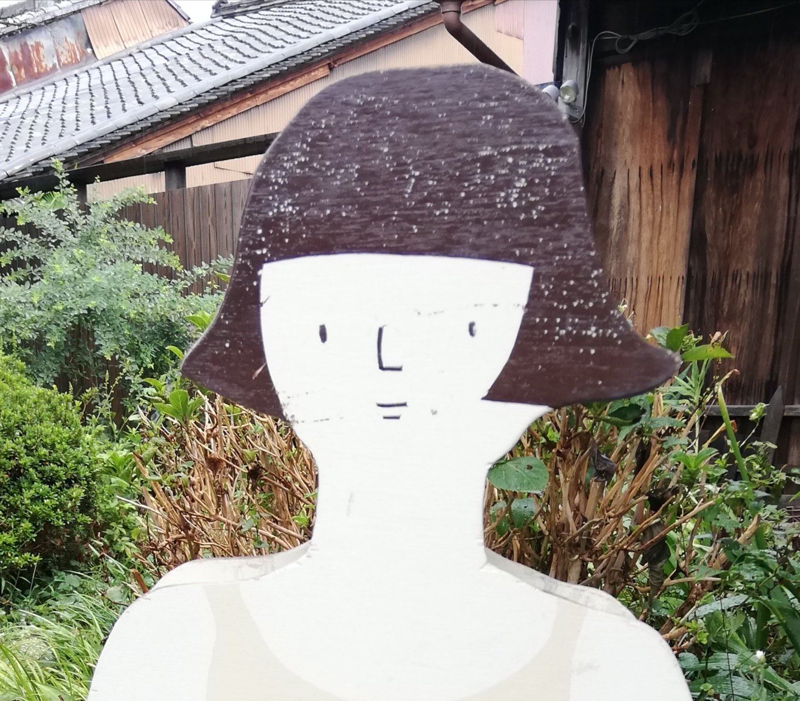

はじめまして

日常から少しそれての寄りみち空間。

身体が心がほうっと息をつきのびやかさ力強さを取りもどせたらせかいはきっとちょっと明るくちょっとやさしくちょっとたのしいものになると思うのです。

お気に入りのカフェやバーのようにみなさんの日常の中での立ち寄りどころとなってリズムやバランスに目を向けるお手伝いができたらと願っています。

うさつぼ店主　藤井裕子

* リフレクソロジスト\
（フットセラピー認定）
* クレイテラピスト\
　（アロマ・フランス認定）
* 植物療法士\
　　（チムグスイ植物療法スクール アドバンス修了）

  

### メニュー紹介

* 足裏基本コース 60分 6,000円\
  足裏の反射区～脚、腰

* 足裏お手軽コース 30分 3,000円\
　足裏の反射区～ふくらはぎ、膝裏

* 上半身60分コース 90分 9,000円\
　手、腕、首、 頭、顔、鎖骨、肩甲骨あたり（オイル使用）

* 上半身60分コース 60分 6,000円\
　首、 頭、顔、鎖骨、肩甲骨あたり（オイル使用）

* 上半身30分コース 30分 3,000円\
　　60分コースと部位は同じ

* 足裏30分＋上半身30分 60分 6,000円

* 追加：1,000円 / 10分

既存コースに限らず気になるところがあればご相談ください

### 《 営業時間 》

10:00 - 16:00 （入店時間）\
不定休のため問い合わせください

### 《 予約 / 問い合わせ 》

usatsubo2022@gmail.com

または インスタグラムからのDMでお願いします\
https://www.instagram.com/usatsubo/

### 《 アクセス / 所在地 》

* 近鉄奈良駅から南へ徒歩12分\
（詳細はご予約時にお伝えいたします）

* 奈良市脇戸町25

* 駐車場がありません\
（自転車、バイクは止められます。申し訳ないのですが、最寄りの駐車場をご利用ください。

* 施術後は普段よりもぽやんと眠気をもよおしやすくなっています。くれぐれもご注意ください。

### 《 注意事項 》

『 お受けできない方 』
 - 水虫などの皮膚病、感染症
 - 心臓や血管に不具合のある方
 - 発熱中
 - お薬を服用中の方 （担当の医師に許可をいただいてください）
 - 医療機関を受診中の方（担当の医師に許可をいただいてください）
 - 妊娠中の方

『施術前後の注意点 』
 - 前後一時間はなるべく飲食をお控えください
 - 施術当日はお酒がまわりやすくなっています
 - 薬の効果が通常より強まる場合があります
 - 施術後はぽうっとしがちです　車の運転にご注意ください

『その他 』
- 男性のご来店は紹介制でお願いしてます
- 二人でご来店の場合、順番にお受けいただきます。\
 同室内でお待ちになるか、もしくはお散歩に出てくださってもけっこうです。
